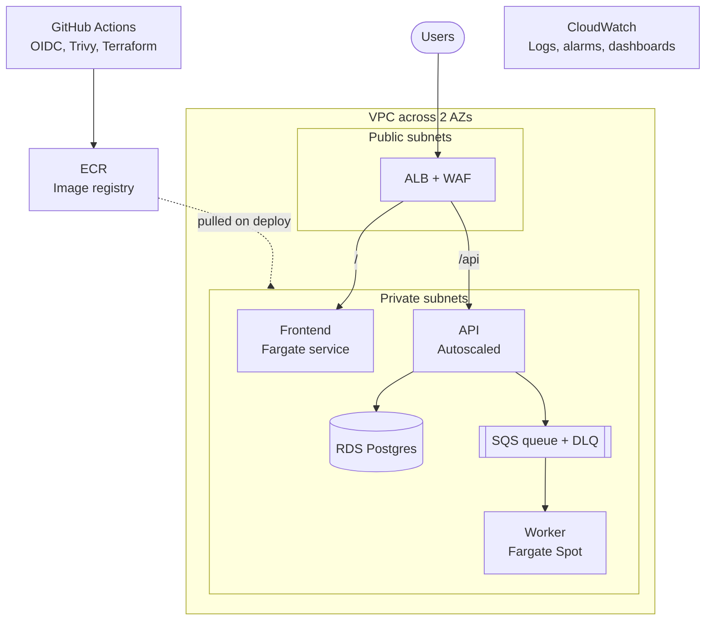

# ECS Fargate Platform

A production-style microservices platform on AWS ECS Fargate. Terraform defines all of it, and GitHub Actions delivers it.

The goal is to show how to **run** a service, not just launch one: deploy safely, scale, observe, recover and control cost.

> **Status:** in progress (8-week build). See [Roadmap](#roadmap).

## Architecture



| Component | Role |
|---|---|
| ALB + WAF | Public entry point. HTTPS via ACM, HTTP redirects to HTTPS. Managed rule groups plus a rate-limit rule. |
| Frontend | Static page served by Nginx. Calls the API. |
| API | Exposes `/health` and `/items`. Reads and writes Postgres, and publishes jobs to SQS. Uses target-tracking autoscaling on CPU and requests per target. |
| Worker | Consumes SQS jobs and writes results to Postgres. Idempotent, handles `SIGTERM`, and runs on Fargate Spot. |
| RDS Postgres | Runs in private subnets. Only the API security group can reach it. Multi-AZ in prod. |
| SQS + DLQ | Async job queue. Failed messages go to a dead-letter queue. |
| ECR | One repository per service. Images are tagged with the git SHA and scanned on push. |
| CloudWatch | Structured JSON logs, dashboards, alarms to SNS, and Container Insights. |

## Repository layout

```
platform-infra/
  bootstrap/            # S3 state (use_lockfile), OIDC provider
  modules/
    vpc/                # incl. NAT + optional VPC endpoints
    ecs-cluster/
    ecs-service/        # task role, autoscaling, optional CodeDeploy
    alb/
    ecr/
    rds/
    sqs/
    dns/                # Route 53 + ACM
    waf/
    monitoring/         # dashboards, alarms, SNS, budgets
  envs/
    dev/                # backend key: dev/terraform.tfstate, env IAM roles
    prod/
  .github/workflows/    # tf-plan.yml, tf-apply.yml, nightly-destroy.yml
  docs/
    architecture.md
    runbook.md
    cost.md
    drills/
    decisions/          # ADRs
  .pre-commit-config.yaml

platform-apps/
  services/
    api/                # Dockerfile, src, tests, taskdef.json, appspec.yaml
    frontend/
    worker/
  migrations/
  loadtest/             # k6 scripts
  docker-compose.yml
  .github/workflows/    # ci.yml, deploy.yml (path filters per service)
  .pre-commit-config.yaml
```

## Tech stack

- **Infrastructure:** Terraform, with S3 remote state and native lockfile
- **Compute:** ECS Fargate and Fargate Spot
- **Networking:** VPC, ALB, Route 53, ACM, AWS WAF and VPC endpoints
- **Data:** RDS Postgres, SQS, Secrets Manager and SSM Parameter Store
- **Delivery:** GitHub Actions, GitHub OIDC, ECR, CodeDeploy (blue/green) and Trivy
- **Quality gates:** tflint, checkov/tfsec, pre-commit and Dependabot/Renovate
- **Observability:** CloudWatch Logs, dashboards, alarms, Container Insights and SNS
- **Testing:** unit tests, a docker-compose integration test and k6 load tests

## Quickstart

### Prerequisites

- Terraform, AWS CLI and Docker
- An AWS account with an AWS Budgets alert configured
- Access to the GitHub organisation

### Run locally

```bash
cd platform-apps
docker compose up --build
```

This starts the frontend, API, worker and a local Postgres.

### Deploy infrastructure

```bash
# 1. One-time: create the state bucket and the GitHub OIDC provider
cd platform-infra/bootstrap
terraform init && terraform apply

# 2. Deploy an environment
cd ../envs/dev
terraform init && terraform plan
```

After bootstrap, all applies run from GitHub Actions through OIDC. Nobody needs static AWS keys.

## CI/CD

**Apps (`platform-apps`)**
1. On each pull request: lint, unit tests, image build and Trivy scan.
2. On merge to `main`: build, scan and push to ECR with the git SHA as the tag.
3. Auto-deploy to dev: register a new task definition revision and run a CodeDeploy blue/green deployment with traffic shifting and a bake time.
4. A CloudWatch alarm or a failed health check triggers an automatic rollback.
5. Promotion to prod requires manual approval.

Path filters make sure only changed services build and deploy.

**Infra (`platform-infra`)**
1. On each pull request: `terraform fmt`, `validate`, tflint and checkov. The `terraform plan` output is posted as a PR comment.
2. On merge: a gated `terraform apply` through GitHub Environments with required approvals.
3. Nightly: a scheduled workflow destroys dev to save cost.

## Environments

| | dev | prod |
|---|---|---|
| State key | `dev/terraform.tfstate` | `prod/terraform.tfstate` |
| NAT gateways | 1 | 1 per AZ |
| Database | Single-AZ | Multi-AZ |
| Min task count | Low | Higher |
| Lifetime | Destroyed nightly | Persistent |
| Deploys | Automatic on merge | Manual approval gate |

Both environments use the same modules with different variables. Each environment and each repo has its own GitHub OIDC role, scoped to least privilege.

## Security

- No static AWS keys anywhere. CI authenticates with GitHub OIDC.
- No secrets in code or env files. Tasks read them from Secrets Manager or SSM at runtime.
- Each task has a separate execution role and task role.
- Containers use multi-stage builds and run as a non-root user.
- Images are scanned by Trivy in CI and by ECR on push.
- WAF uses managed rule groups plus a rate limit.
- Findings from IAM Access Analyzer are reviewed and fixed.

## Observability

- Structured JSON logs with request IDs across all services.
- A CloudWatch dashboard shows ALB 5xx and latency, CPU and memory, running tasks and queue depth.
- Alarms go to SNS email for the 5xx rate, unhealthy hosts, DLQ depth and high CPU.
- Container Insights and log metric filters track error counts.

## Cost controls

- Dev is destroyed every night, because NAT gateways and ALBs cost money even when idle.
- The worker runs on Fargate Spot.
- VPC endpoints for ECR, S3, Logs and Secrets Manager reduce NAT traffic.
- AWS Budgets alerts are configured.

The cost write-up in [platform-infra/docs/cost.md](platform-infra/docs/cost.md) has the actual and estimated monthly spend.

## Documentation

- [Architecture](platform-infra/docs/architecture.md)
- [Runbook](platform-infra/docs/runbook.md): deploy, rollback, scale and alert response
- [Cost](platform-infra/docs/cost.md)
- [Failure drills](platform-infra/docs/drills/)
- [Architecture Decision Records](platform-infra/docs/decisions/): ECS vs EKS, Fargate vs EC2, rolling vs blue/green, NAT vs VPC endpoints

## Roadmap

- [ ] **Week 1: Foundations.** Remote state, OIDC, VPC, ECS cluster, ALB, three containers running locally and the first CI run.
- [ ] **Week 2: First real deploys.** Images in ECR, HTTPS, secrets, RDS and the nightly dev teardown.
- [ ] **Week 3: CI/CD pipeline.** Auto-deploy to dev, circuit breaker, plan on PRs and gated apply.
- [ ] **Week 4: Platform module and worker.** A new service in about 15 lines, SQS + DLQ, a Spot worker and VPC endpoints.
- [ ] **Week 5: Safe deploys and observability.** CodeDeploy blue/green, dashboards, alarms and alarm-driven rollback.
- [ ] **Week 6: Scale, security and prod.** Autoscaling proven with k6, WAF, least-privilege OIDC and the prod promotion gate.
- [ ] **Week 7: Resilience and cost.** Three failure drills, the runbook, the cost write-up and a timed rebuild from scratch.
- [ ] **Week 8: Polish.** Diagrams, ADRs, a demo video and blog posts.

### Definition of done

- Everything is provisioned from Terraform, with remote state, reusable modules and separate dev and prod environments.
- No static AWS keys anywhere and no secrets in code.
- CI/CD covers lint, test, build, scan, push and deploy, plus plan on PRs and a gated apply.
- Autoscaling is proven with a k6 load test. Dashboards and alarms are in place.
- Automatic rollback is demonstrated, and three failure drills are documented.
- The runbook, ADRs, architecture diagram, cost write-up and demo video are complete.

## Team

| Habib | Sachin |
|---|---|
| Networking, ECS services, Terraform modules, CI/CD, environments, blue/green deploys, runbook | Apps and containers, secrets and database, observability, security, autoscaling and load testing, cost, failure drills |

Every pull request is reviewed by the other person, so both of us can explain the whole system.
